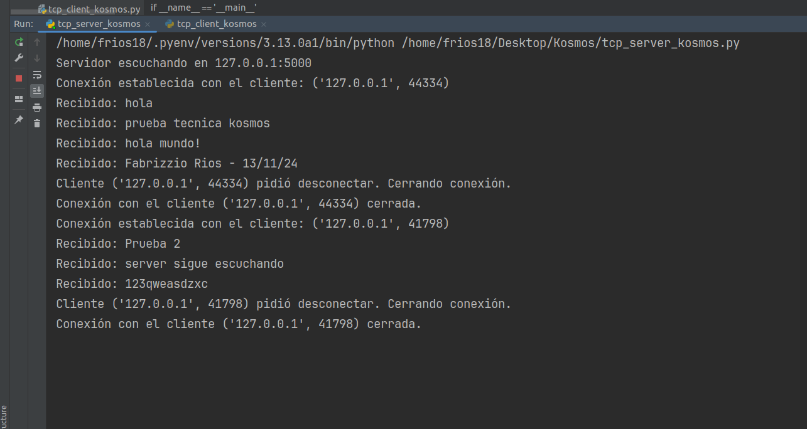
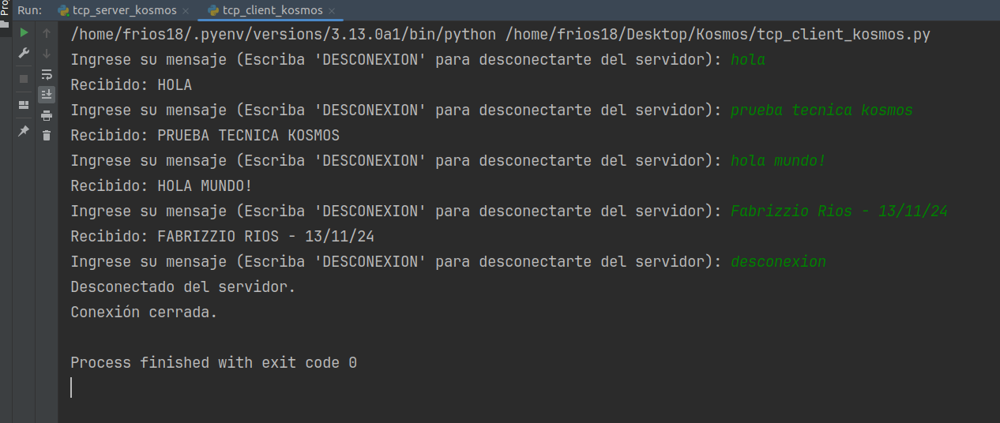
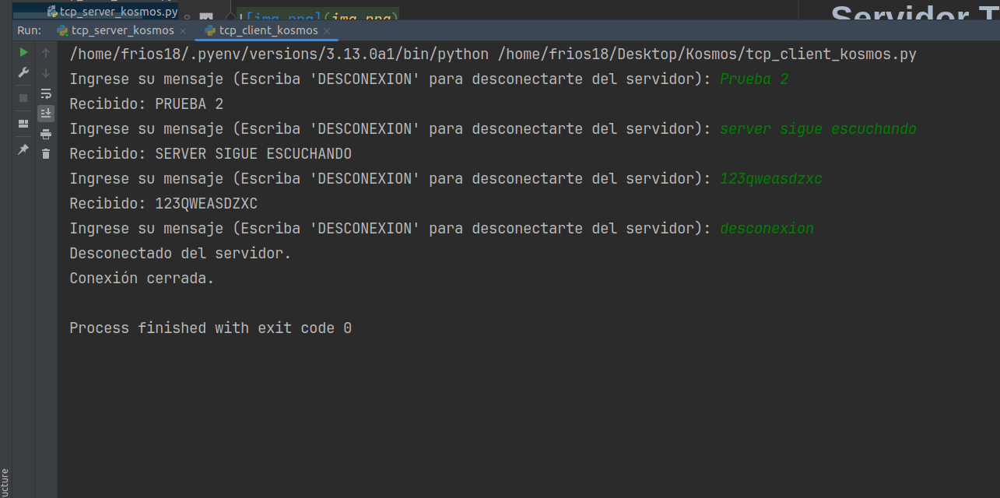

# Ejercicio Técnico: Cliente y Servidor TCP en Python 🐍🖥️
## Hecho por: Fabrizzio Rios - 13 / Nov /2024 

## Descripción 📖

Este ejercicio implementa un servidor y un cliente TCP utilizando la librería estándar `socket` de Python. El servidor espera conexiones en un puerto específico y, al recibir un mensaje, responde con el mensaje en mayúsculas. Si el mensaje recibido es "DESCONEXION", el servidor cierra la conexión con el cliente y le envía un mensaje confirmando la desconexión.

## Librería utilizada 📕

- **socket**: La librería `socket` de Python se utiliza para crear sockets de red y establecer una comunicación entre el cliente y el servidor. Esta librería es parte de la biblioteca estándar de Python, lo que la convierte en una herramienta conveniente para establecer comunicaciones TCP/IP.

## Requisitos 🛠️

- Python 3.x
- No se requieren librerías adicionales, ya que `socket` es parte de la biblioteca estándar de Python.

## Estructura del proyecto 🩻

El proyecto consta de dos componentes principales:

1. **Servidor TCP (`tcp_server_kosmos.py`)**:
    - El servidor escucha las conexiones entrantes en el puerto `5000` de la dirección IP local (`127.0.0.1`).
    - Responde a los mensajes enviados por los clientes, devolviendo los mensajes en mayúsculas.
    - Si el mensaje es "DESCONEXION", el servidor cierra la conexión con ese cliente y espera nuevas conexiones.


2. **Cliente TCP (`tcp_client_kosmos.py`)**:
    - El cliente se conecta al servidor en `127.0.0.1:5000` y puede enviar mensajes de texto.
    - El cliente también puede enviar el mensaje "DESCONEXION" para cerrar la conexión con el servidor.
    - El cliente recibe las respuestas del servidor y las imprime en consola.
# Servidor 💾
**Prueba 1**:


# Cliente 💾

**Prueba 1**:



**Prueba 2**:



## Cómo ejecutar ▶️

1. **Ejecutar el servidor**:
   - Abre una terminal y navega al directorio donde se encuentran los archivos `tcp_server_kosmos.py` y `tcp_client_kosmos.py`.
   - Ejecuta el servidor con el siguiente comando:
     ```bash
     python tcp_server_kosmos.py
     ```
   - El servidor comenzará a escuchar conexiones entrantes en el puerto `5000`.


2. **Ejecutar el cliente**: 
   - En otra terminal, ejecuta el cliente con el siguiente comando:
     ```bash
     python tcp_client_kosmos.py
     ```
   - El cliente se conectará al servidor y podrás comenzar a enviar mensajes.